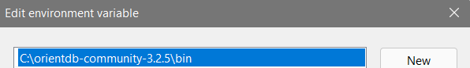
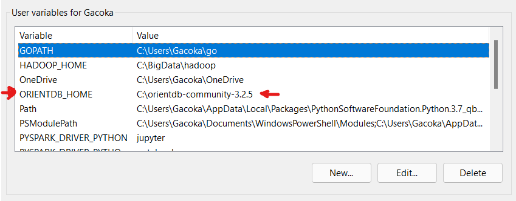
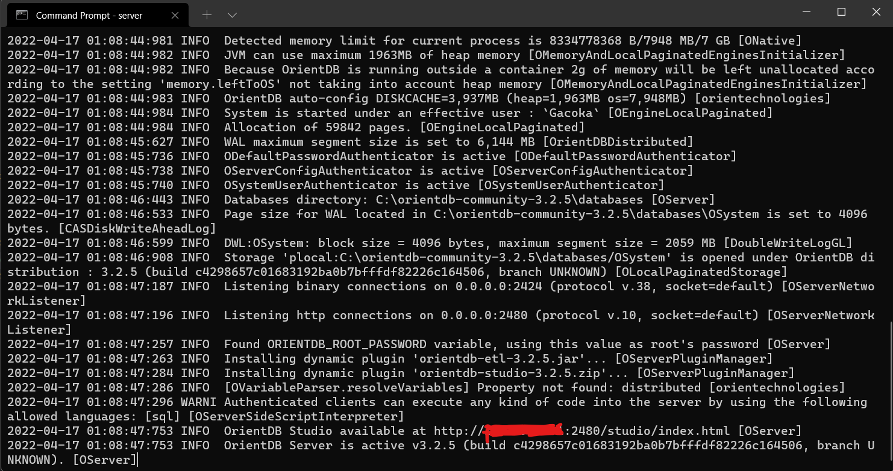

### Setting up OrientDB locally
1. Download [OrientDB v3.2.5 GA Community Edition](https://orientdb.org/download) from the OrientDB website.
  If the latest version has changed, download the zip file [here](https://repo1.maven.org/maven2/com/orientechnologies/orientdb-community/3.2.5/orientdb-community-3.2.5.zip).
2. Unzip the download and copy `orientdb-community-3.2.5` to the `C:\` drive.
3. Add the folder path to your environment variables i.e. `Control Panel > Edit the system environment variables > Environment Variables > User variables for {USERNAME} > C:\orientdb-community-3.2.5\bin`
  
4. Set OrientDB home environment variable in PATH i.e `ORIENTDB_HOME` = `C:\orientdb-community-3.2.5`
  
5. Open CMD and type in `server`. 
  - This will run the `server.exe` file that is inside the `C:\orientdb-community-3.2.5\bin` folder on port `2424`. You should see something like this:
  
6. Now that the server is running, you can install and run the codepropertygraph module.