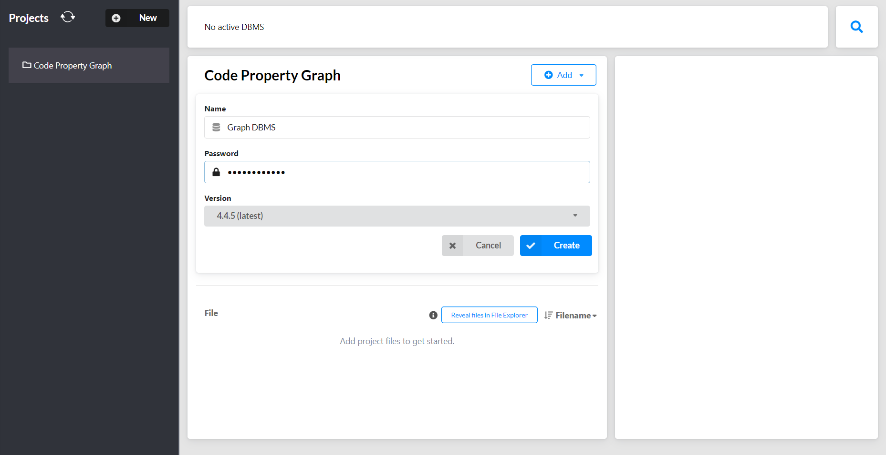
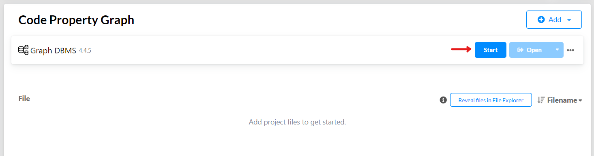
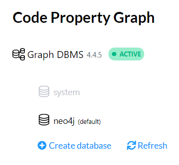

## Code Property Graph
<p align="center">
  <a href="https://github.com/markgacoka/codepropertygraph/pulse" alt="Stars"></a>
  <a href="https://github.com/markgacoka/codepropertygraph/releases" alt="Release"></a>
  <a href="https://github.com/markgacoka/codepropertygraph/graphs/contributors" alt="Maintained"></a>
</p>

<p align="center"></p>

This library is an implementation of a Code Property Graph as seen in the paper published by [Fabian Yamaguchi](https://fabianyamaguchi.com/) on *Modeling and Discovering Vulnerabilities with [Code Property Graphs](https://www.sec.cs.tu-bs.de/pubs/2014-ieeesp.pdf)*

A code property graph is a highly efficient data structure designed to mine large codebases for similar programming patterns. The data structure can be loaded into a graph database where properties of code can be queried. Code property graphs are intended to be code-agnostic and highly scalable making it one of the best choices for code representation.


## Running as a Library
### Installation
Requires:
- `Python 3`
- `pip3`
```
pip install codepropertygraph
```

### Using the code as a library
```python
from codepropertygraph import CPG

code = """a = 1; b = 2; print(a + b)"""

graph = CPG(code)
print(graph)

> Graph(Nodes(a, b), Edges([a, b]))
```

## Running from Source
### Setting up Neo4J locally
1. Download [Neo4J Desktop v4.4.5](https://neo4j.com/download/) to create local graph databases locally and remotely from your desktop.
  If the latest version has changed, use this link to download the [version]((https://neo4j.com/download/neo4j-desktop/?edition=desktop&flavour=winstall64&release=1.4.15&offline=true)) used for development.
2. Create a **new project** and a **new local graph database** as shown below. It might take a few moments to finish loading.
  
3. Start the database. Make sure the DB is active before heading onto the [Installation](#installation-1) and [Running the application](#running-the-application) sections.

| Starting the database | Active Database |
|-----------------------|-----------------|
|  |  |

### Installation
To install the repository, you need to clone it and run it inside a virtual environment. Running `main.py` generates a Code Property Graph of the simple addition script inside `examples/` and saves it to `output/`.
```
git clone https://github.com/markgacoka/codepropertygraph.git
cd codepropertygraph

python3 -m venv venv
source venv/bin/activate
pip install -r requirements.txt
```

### Running the Application
```
python main.py
```

## Testing
Run all tests
```
pytest tests
```

## Updating Library

1. Change the version number
```
--> VERSION="0.0.9"
DESCRIPTION="A Python implementation of a Code Property Graph."
LONG_DESCRIPTION="A tool for ..."

setup(
    name='codepropertygraph',
    version=VERSION,
```

2. Upload to Pypi
```
python setup.py sdist bdist_wheel
pip install twine
twine upload dist/*
```


For first time contributors, read the [CONTRIBUTING](https://github.com/markgacoka/codepropertygraph/blob/main/CONTRIBUTING.md) page.
