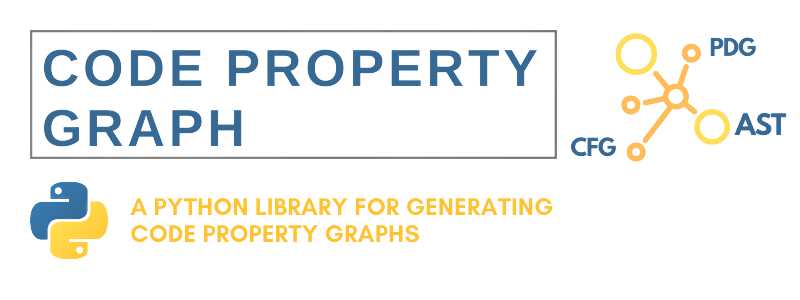
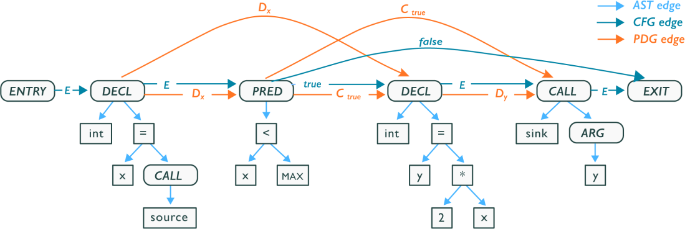

## Code Property Graph
<p align="center">
  <a href="https://github.com/markgacoka/codepropertygraph/pulse" alt="Stars"></a>
  <a href="https://github.com/markgacoka/codepropertygraph/releases" alt="Release"></a>
  <a href="https://github.com/markgacoka/codepropertygraph/graphs/contributors" alt="Maintained"></a>
</p>

<p align="center"></p>

This library is an implementation of a Code Property Graph as seen in the paper published by [Fabian Yamaguchi](https://fabianyamaguchi.com/) on *Modeling and Discovering Vulnerabilities with [Code Property Graphs](https://www.sec.cs.tu-bs.de/pubs/2014-ieeesp.pdf)*

A code property graph is a highly efficient data structure designed to mine large codebases for similar programming patterns. The data structure can be loaded into a graph database where properties of code can be queried. Code property graphs are intended to be code-agnostic and highly scalable making it one of the best choices for code representation.



## Running as a Library
### Installation
Requires:
- `Python 3`
- `pip3`
```
pip install codepropertygraph
```

### Using the code as a library
```python
import os
from dotenv import load_dotenv
from codepropertygraph import get_neo4j_connection

load_dotenv()
USERNAME = os.environ["NEO4J_USERNAME"]
PASSWORD = os.environ["NEO4J_PASSWORD"]
URI = "neo4j+s://cb8ae961.databases.neo4j.io"

# Attempt to get a connection
driver = get_neo4j_connection(URI, (USERNAME, PASSWORD))

# If the connection is successful, you can use the driver
if driver:
    with driver.session(database="neo4j") as session:
        result = session.run("MATCH (n) RETURN count(n) AS node_count")
        node_count = result.single()["node_count"]
        print(f"Number of nodes in the database: {node_count}")
    
    driver.close()

> Number of nodes in the database: 0
```

